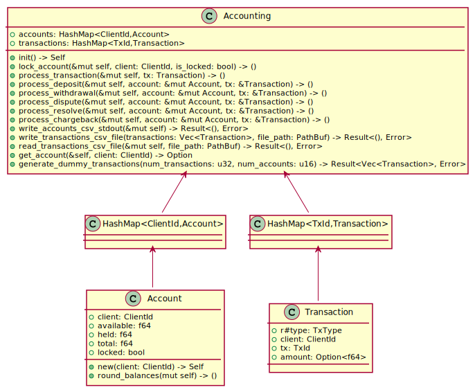

# Transaction Simulator (tx-sim)

A basic in-memory transactions accounting processor. For demonstrative purposes only.

## CLI Usage

```
cargo run -- transactions.csv > accounts.csv
```

## Trouble Shooting & Errors

If your `transactions.csv` file has leading empty spaces, it will fail to serialize into the correct value type (e.g. u16, u32, f64). If you're receiving a serialization error, check your csv file for correctness. An example `transactions.csv` file is provided below and in this repo.

## Example `transactions.csv` file

```csv
type,client,tx,amount
dispute,10,255,
resolve,10,707,
resolve,9,740,
deposit,3,458,562.3807
withdrawal,1,446,928.1613
resolve,8,133,
chargeback,10,173,
```

## Architecture



The binary itself is a wrapper around a core library that implements a programmatic API surface for modularity and composition.

This library does not provide an abstract trait for processing transactions, however, this would be an added benefit for building a transactions aggregator over multiple payment networks.

### Multi-Threading and Async

This library does not make use of multi-threading, parallel processing or asynchronous tasks. These features would necessary in a production system, and the `Transaction` structure would need additional attributes to track and guarantee ordering, such as a Lamport timestamp or other unique identifier.

### Processing Transactions

Each transaction is processed when it is read from the csv row. Accounts and transactions are stored in HashMaps for efficient account retrievals and transaction lookups.

Steps for processing a transaction include:

1. Find or create an account associated with the client id;

2. Use the transaction enum type [`TxType`](./src/models.rs#L16) in a match statement to determine how the transaction should modify the account;

3. Update the account balances (i.e. held, total, available) according to the transaction type and amount;

4. Save the account in a HashMap with the client id as the key and the [`Account`](./src/models.rs#L80) struct as the value. Use a HashMap for O(1) lookup.

5. Save the transaction in a HashMap with the tx id as the key and the [`Transaction`](./src/models.rs#L63) struct as the value. Use a HashMap for looking up a transaction if the type is `Dispute`, `Resolve` or `Chargeback`;

6. Iterate over the account values in the HashMap and serialize value into CSV row;

7. Write accounts CSV to stdout;

## Docs

```
> cargo doc && open ./target/doc/tx_sim/index.html
```

Run `cargo doc` to generate rustdoc and view html files.

## Testing

```
> cargo test
```

Run `cargo test` to run a set of test cases for processing transactions and checking account balance correctness. Additionally, running the test case will generate new sample transaction data in `transactions.csv`.

### Example Charge Back Test Case

```rust
#[test]
fn test_account_chargeback() -> Result<(), Error> {
    let mut accounting = Accounting::init();

    let client = 1;
    let deposit_amount = 100.0;

    accounting.process_transaction(Transaction {
        client,
        tx: 1,
        r#type: TxType::Deposit,
        amount: Some(deposit_amount),
    });

    accounting.process_transaction(Transaction {
        client,
        tx: 1,
        r#type: TxType::Dispute,
        amount: None,
    });

    // Ensure account total available is reduced by disputed tx amount
    assert_eq!(
        accounting.get_account(client).map(|a| a.total),
        Some(deposit_amount)
    );

    assert_eq!(
        accounting.get_account(client).map(|a| a.available),
        Some(0.0)
    );

    assert_eq!(
        accounting.get_account(client).map(|a| a.held),
        Some(deposit_amount)
    );

    // Test transaction charge back
    accounting.process_transaction(Transaction {
        client,
        tx: 1,
        r#type: TxType::Chargeback,
        amount: None,
    });

    // Ensure account total available is available after resolution;
    assert_eq!(accounting.get_account(client).map(|a| a.total), Some(0.0));

    // Ensure available funds are reduced by funds withdrawn after charge back;
    assert_eq!(
        accounting.get_account(client).map(|a| a.available),
        Some(0.0)
    );

    // Ensure amount held after charge back is 0.0
    assert_eq!(accounting.get_account(client).map(|a| a.held), Some(0.0));

    // Ensure account is locked;
    assert_eq!(accounting.get_account(client).map(|a| a.locked), Some(true));

    Ok(())
}
```
